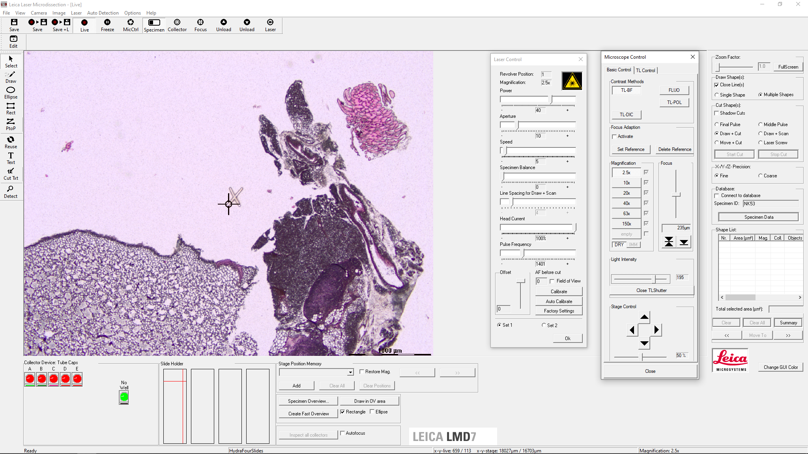
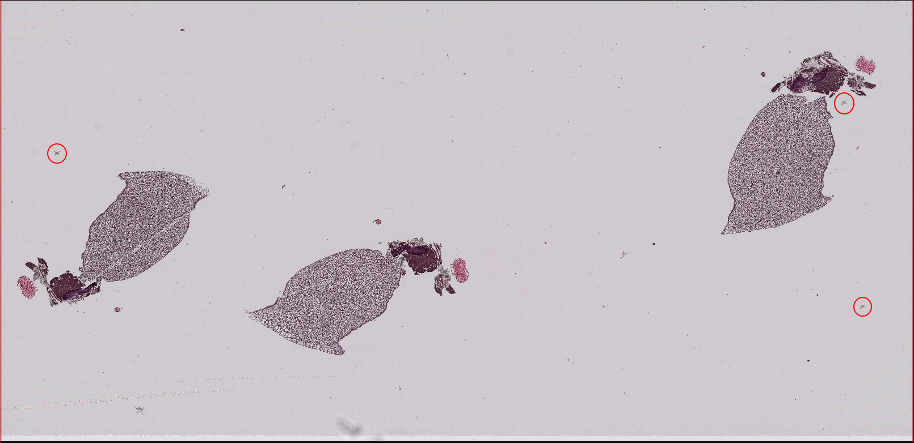
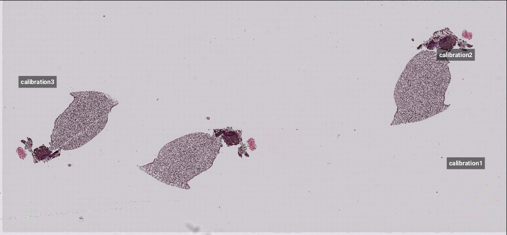
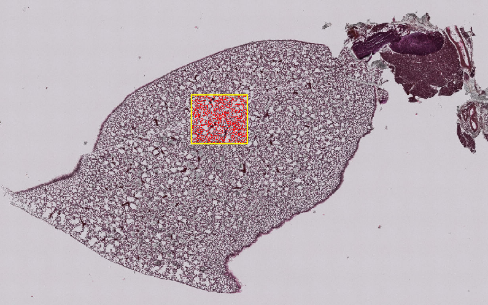
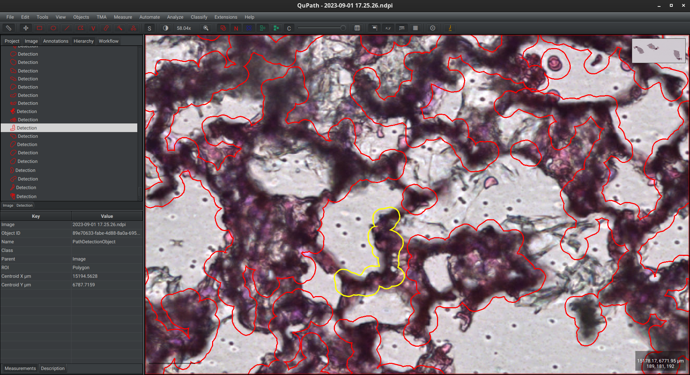

### Example
This is a simple example to showcase the workflow using 
sample lung tissue.

**First step**: Acquiring an image.

We marked 3 points in the slide. This can be done
in any way, here we burned 3 'X' marks with an LMD microscope
in the defalut calibration positions, one of which is shown below.

Then we acquired a scan of the slide and loaded it
into QuPath (we can see the 3 marks we 
created before):

Next, we inserted 3 separate annotation points and name each one accordingly
for export later. These coordinates will be used by Leica's
LMD software to convert the coordinates for our shapes,
you will need to mark the same points again under the Leica's 
viewer and they have to be in a correct order.

*This can be done at anytime before exporting the shapes.*

*You can also create a mirrored copy of an image. See "Mirroring"
under "[Usage Details]()".*

**Second step**: Segmentation.
 
Here, for the sake of example,
we simply run cell detection to mark some ROIs:

In order to cut them, we need to enlarge these particular objects. You have 
to adjust laser's aperture and power in a way it is suffcient enough to cut
the shapes out, but not too powerful to burn them. We selected
all detections and expanded them by
the radius of 3 micrometers. Then, we deleted unnecessary parent annotation.

*CAUTION: Expanding may result in the loss of data in rare cases, it is advisible 
to work on a copy or process smaller number of objects at once.*

*If you have only one class, the second option doesn't matter. In case of 
intersecting each other, the shapes will be merged. As above, see "[Usage Details]()"
for more information.*

*You can convert in between simple detections and annotations like this e.g. to 
use tools dedicated for annotations from QuPath's "Objects/Annotations..." menu.
Here we converted our shapes to annotations to fill unnecessary holes contained within
single shapes and then converted back to detections.*

**Third step**: Export.

Since we didn't have any classes, we could only assign all objects to some of the
collector's cap.

The directory "LMD data" was created and the XML file saved in it (for reference 
you can see [the XML from this example](./assets/example1/2023-09-01%2017.25.26_2023-09-03_20-15-53.xml) 
in assests folder).

