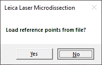

### Basic Example 
This is a simple example to showcase the workflow with slides using 
a lung tissue as a sample.

**First step**: Acquiring an image.

Before scanning our slide, we marked 3 points on it. This can be done
in any way, here we burned 3 'X' marks with an LMD microscope, one of 
which is shown below. The purpose of it is to have some kind of landmark which
is easy to find later in both QuPath and LMD software. 

Then we acquired a scan of the slide with a
Hamamatsu S360 slidescanner
(we can see the 3 marks we 
created before):

**Second step**: Segmentation and export preparation in QuPath.

Before segmentation, we prepared the data in advance by
inserting 3 separate annotation points and naming each one accordingly
for the export later (calibration1, calibration2, calibration3). 
These coordinates will be used by Leica's
LMD software to convert the coordinates for our shapes,
you will need to mark the same points again under the Leica's 
viewer in the same order as your annotations names suggest. The names are not
case-sensitive, just make sure you don't have a typo.

*You can also create a mirrored copy of an image, which
can be helpful for navigating under LMD software later.
See "Mirroring" under "[Usage Details]()".*

Next, for the sake of example,
we simply run cell detection to mark some ROIs:

In order to cut them, we need to enlarge these particular objects. Later, you will have 
to adjust laser's aperture and power in a way it is suffcient enough to cut
the shapes out, but not too powerful to burn them. We selected
all detections and expanded them by
the radius of 3 micrometers.
Then, we deleted unnecessary parent annotation.

*How much to expand your shapes dependes on factors,
like magnification, laser settings, kind of tissue you're working with, and will
likely require some testing.*

*In the same dialog you also set a behaviour when enlarged
detections intersect each other. If both
have the same class you can merge them or keep one of the objects removing the
other. First option will likely result in acquiring more objects in general marked
with ROIs extending over many cells. Second option will keep fewer objects but
will not include any other potentailly unwanted areas. Creating a copy of your
image and testing different settings is advisible.*

*You can convert in between simple detections and annotations like this e.g. to 
use tools dedicated for annotations from QuPath's "Objects/Annotations..." menu.*

**Third step**: Export.

Since we didn't have any classes, we could only assign all objects to one of the
collector's caps.

The directory "LMD data" was created and the XML file saved in it (for reference 
you can see [the XML from this example](./assets/example1/2023-09-01%2017.25.26_2023-09-04_16-24-03.xml) 
in assests folder).

**Fourth step**: Import to the LMD software.

Head to "File/Import Shapes..."

First it asks if the calibration used last time is the one you want to use now.

Then if you have a file with reference points.

If this is your first time doing this, you can select 'no' and go to the calibration view.

*The points you are going to select now can be written to a file and loaded next time.*

During calibration, we have to choose as accurately as possible, the same points we marked
in QuPath. Here is an example of the same point from above, this time in the LMD software:

In the next dialog the software asks if you want to use 
"the actual magnification".
Set the magnification you want to use to cut the cells out and select "yes".

After loading the shapes, their counturs should be visible:

Depending on the accuracy of your calibration points, 
these shapes will be more or less
shifted, you can move them all at once to adjust. To select all shapes, press
shift and select the last one on the shape list. 

