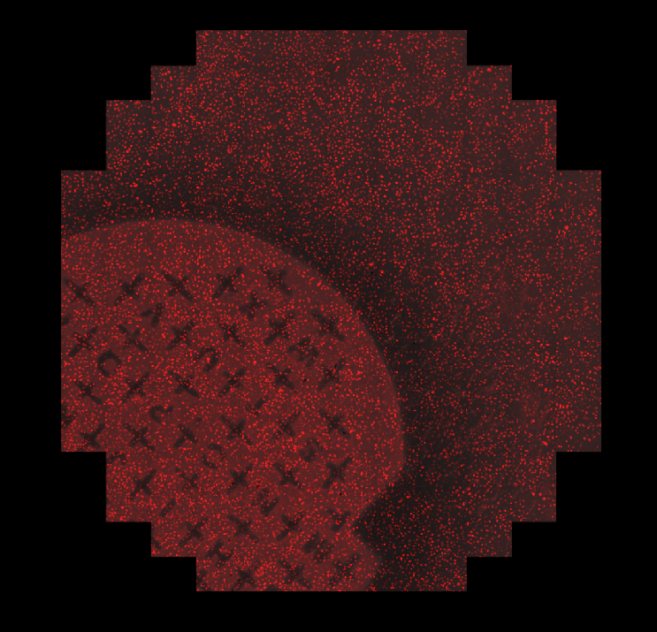
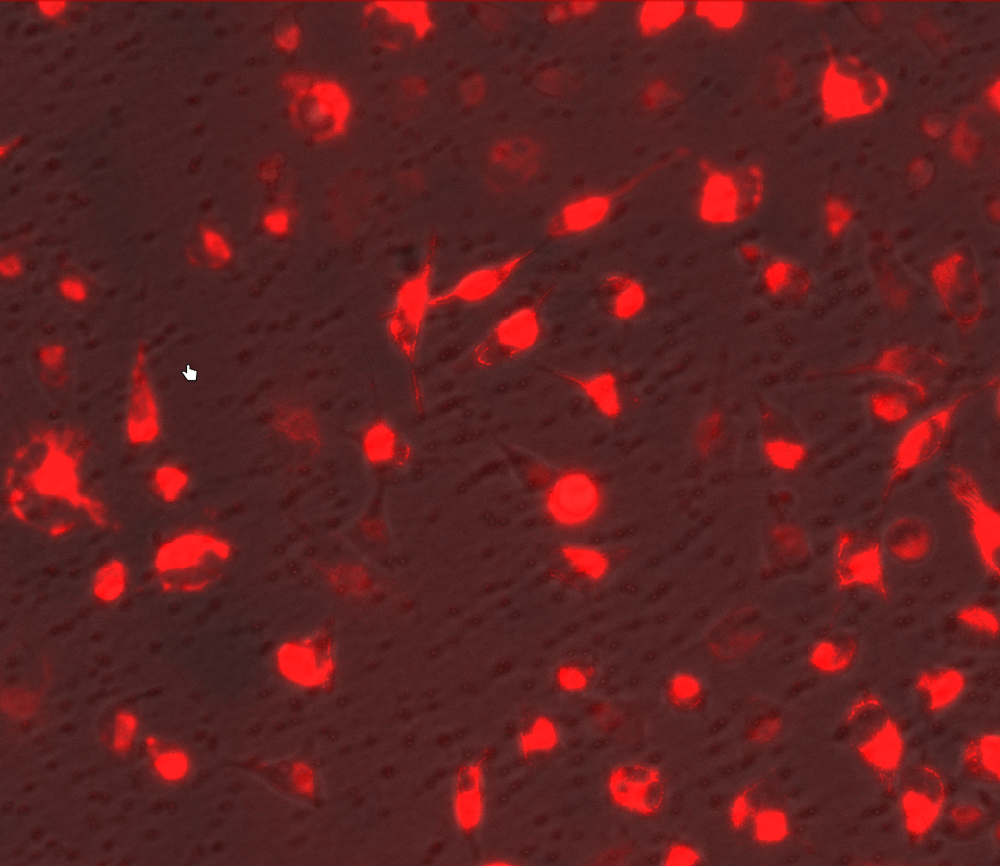
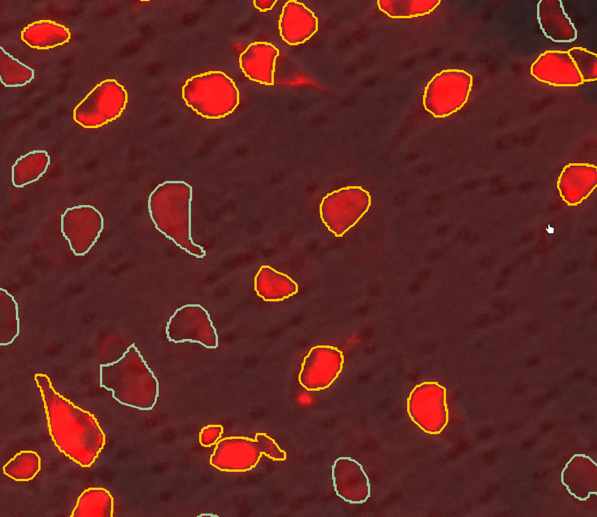
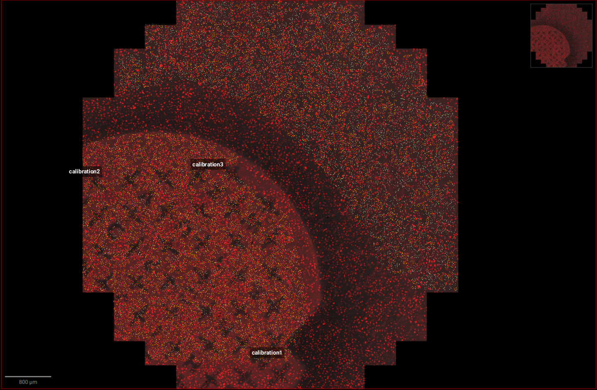

### Example with Hela cells

Example of the workflow with using LMD dish.

**First step**: Acquiring an image.

We have obtained an image using EVOS microscope 
(EVOS FL Auto 2 Imaging System). Then processed and loaded a multichannel
image into QuPath:

We can see the cells, as well as the marks made on a membrane
which will help us locate the calibration later. 

**Second step**: Segmentation and export preparation in QuPath

The aim here was to discriminate between darker and brigther mitochondria:

and we have run a custom cellpose script for that purpose with following result:

1. Just in case we worked on a copy of our image.
2. In order to cut the cells out, we expanded them by the radius of 15 um.
3. We filled the holes within all objects to prevent unnecessary cutting. 

'Other' class correspanded to bright, 'Stroma' to dark cells.
Choosing a class priority will result in preserving this class if object
of different class intersects it while expanding.

SCREENCAST GOES HERE

Then we put 3 calibration points:

**Third step**: Export.

SCREENCAST GOES HERE

**Fourth step**: Import to the LMD software.

